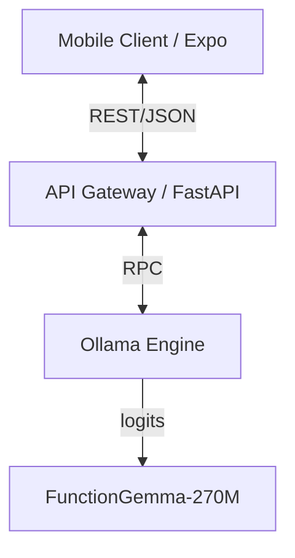

# Nova: Edge-Native AI Orchestration Architecture

This repository contains the reference implementation for **Nova**, a distributed mobile AI architecture designed for low-latency, privacy-preserving inference. It leverages a split-compute model where **Expo (React Native)** serves as the client presentation layer, communicating with a local inference node powered by **FunctionGemma-270M-IT** via **Ollama**.

## System Architecture

The system implements a client-server topology designed for edge deployment:

*   **Client Layer**: React Native application utilizing asynchronous I/O for non-blocking UI rendering.
*   **Orchestration Layer**: FastAPI microservice serving as an API Gateway. It handles request normalization, prompt injection, and response schema enforcement.
*   **Inference Engine**: Ollama instance hosting Quantized GGUF models (FunctionGemma-270M), optimized for CPU-based inference on commodity hardware.



## Features

### 1. AI Chat Interface
General-purpose conversational AI powered by FunctionGemma running locally via Ollama.

### 2. Voice-Controlled Browser
Natural language browser control with function calling capabilities:

**Supported Commands:**
- `"Open Google"` → Navigates to google.com
- `"Search for cats"` → Performs Google search
- `"Go back"` → Browser back navigation
- `"Go forward"` → Browser forward navigation
- `"Refresh page"` → Reloads current page

**Architecture:**
```
Voice Input → Web Speech API → Backend (/parse-command) → FunctionGemma → Structured Function Call → Browser Action
```

## Technical Specifications

### Inference Node (Backend)
The backend service functions as a middleware layer responsible for **Structured Output Enforcement**. It utilizes **Pydantic** models to validate stochastic LLM outputs against strict JSON schemas, ensuring type safety for the client application.

#### Prerequisites
*   **Runtime**: Python 3.10+
*   **Inference Server**: Ollama (v0.1.0 or higher)
*   **Model Registry**: `functiongemma:latest` or `functiongemma:270m`

#### Deployment Strategy

1.  **Environment Initialization**:
    ```bash
    cd backend
    python -m venv venv
    .\venv\Scripts\activate  # Windows
    # source venv/bin/activate  # macOS/Linux
    pip install -r requirements.txt
    ```

2.  **Service Instantiation**:
    Execute the Uvicorn ASGI server:
    ```bash
    python -m uvicorn main:app --host 0.0.0.0 --port 8000 --reload
    ```
    *The service exposes endpoints at `0.0.0.0:8000` to allow local network discovery.*

#### API Endpoints

**POST /chat**
- General conversational endpoint
- Input: `{ messages: [...] }`
- Output: `{ intent: string, message: string, data: {} }`

**POST /parse-command**
- Function calling endpoint for voice commands
- Input: `{ command: string }`
- Output: `{ name: string, parameters: {...} }`

### Presentation Layer (Mobile Client)
Built on the Expo framework, the client enforces a strict View-Model separation. It consumes the structured JSON payload from the API Gateway and renders dynamic UI components based on the detected `intent` vector.

#### Build Instructions

1.  **Dependency Resolution**:
    ```bash
    cd ai-mobile
    npm install
    ```

2.  **Development Server**:
    Launch the Metro Bundler:
    ```bash
    npx expo start
    ```

    For physical device testing with tunnel:
    ```bash
    npx expo start --tunnel
    ```

## Network Configuration
For distinct physical devices (e.g., mobile handset and dev host), **Network Discovery** is required.
The app automatically detects the host IP via `expo-constants`, but you can manually configure it in `ai-mobile/services/api.ts` and `ai-mobile/services/voiceService.ts`.

```typescript
// Manual configuration example
const API_URL = 'http://<YOUR_LOCAL_IP>:8000';
```

## Voice Recognition Support

### Platform Support Matrix

| Platform | Technology | Status |
|----------|-----------|--------|
| **Web** | Web Speech API | ✅ Fully Supported (Chrome, Edge) |
| **iOS** | Native Speech Recognition | ✅ Fully Supported |
| **Android** | Native Speech Recognition | ✅ Fully Supported |

### Implementation Details

The app uses a **cross-platform voice recognition hook** (`useVoiceRecognition`) that automatically selects the appropriate recognition engine:

- **Web**: Uses browser's `webkitSpeechRecognition` API
- **iOS/Android**: Uses `expo-speech-recognition` with native bindings

### Permissions

**iOS**: Automatically requests microphone and speech recognition permissions on first use.

**Android**: Requires `RECORD_AUDIO` permission (configured in `app.json`).

### Building for Native Devices

Since `expo-speech-recognition` requires native code, you need to create a development build:

```bash
# Install EAS CLI
npm install -g eas-cli

# Login to Expo
eas login

# Create development build
eas build --profile development --platform android
# or
eas build --profile development --platform ios
```

Alternatively, use Expo Go for testing (limited native module support) or create a local development build:

```bash
npx expo run:android
# or
npx expo run:ios
```

## Capabilities
*   **Function Calling/Tool Use**: Native support for binding LLM outputs to specific functional capabilities (e.g., browser navigation, search).
*   **Schema Validation**: Runtime validation of inference outputs using Pydantic, mitigating hallucination risks in structured data fields.
*   **Offline-Ready Architecture**: System supports future migration to on-device inference (via direct GGUF loading) without architectural refactoring.
*   **Voice-First UX**: Real-time feedback panels with transcription display and status updates.

## Project Structure

```
Nova/
├── backend/
│   ├── main.py              # FastAPI server with chat and function calling
│   ├── requirements.txt     # Python dependencies
│   └── venv/               # Virtual environment (gitignored)
├── ai-mobile/
│   ├── app/
│   │   └── (tabs)/
│   │       ├── index.tsx    # Chat interface
│   │       ├── browser.tsx  # Voice browser
│   │       └── explore.tsx  # Info/settings
│   ├── services/
│   │   ├── api.ts          # Chat API service
│   │   └── voiceService.ts # Voice command parsing
│   └── package.json
└── README.md
```

## Development Workflow

1. **Start Backend**:
   ```bash
   cd backend
   .\venv\Scripts\activate
   python -m uvicorn main:app --host 0.0.0.0 --port 8000 --reload
   ```

2. **Start Frontend**:
   ```bash
   cd ai-mobile
   npx expo start --tunnel
   ```

3. **Test Voice Commands** (Web only):
   - Navigate to Browser tab
   - Click microphone icon
   - Speak command (e.g., "search for AI news")
   - Watch real-time parsing and execution

## Future Enhancements

- [ ] On-device inference using llama.cpp bindings
- [ ] Native mobile speech recognition
- [ ] Additional browser commands (scroll, click, form fill)
- [ ] Multi-modal inputs (image + voice)
- [ ] Offline mode with cached responses
- [ ] Custom tool definitions via config files

## License

MIT
